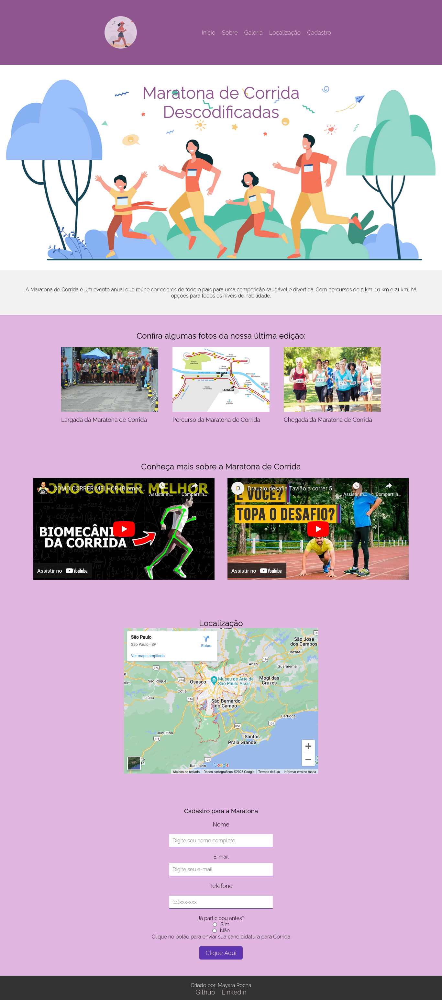

# Desafio-projeto-de-uma-landpage
O desafio será fazer um projeto em HTML, CSS e JavaScript de uma landpage (site) de um tema de sua preferência, com itens obrigatórios e layout definido;.

## Descrição do projeto
Este projeto é uma landing page da Maratona de Corrida, que é um evento anual de corrida. A página possui um header com um logo e um menu de navegação para as diferentes seções da página. A seção "Início" apresenta um título sobre a maratona. A seção "Sobre" fornece informações gerais sobre a corrida, enquanto a seção "Galeria" mostra fotos da última edição. A seção "Sobre" também inclui dois vídeos do YouTube sobre corrida. A seção "Localização" exibe um mapa da localização da maratona. A seção "Cadastro" permite que os usuários se cadastrem para participar da corrida, preenchendo um formulário com informações pessoais. A página também possui um rodapé que apresenta informações sobre o criador da página e links para suas contas nas redes sociais.

Criado por Mayara Rocha
